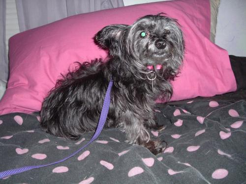

# CONVOLUTION NEURAL NETWORK IMAGE CLASSIFICATION 📷

This project aims to explore / demonstrate the ability of Neural Networks to successfully categorise and classify image data. The data is provided by Microsoft with the intention of helping to improve CAPTCHA tests.

📈 The model achieves a validation accuracy of ~0.81 (81%)
### Background from Microsoft: ###

_Web services are often protected with a challenge that's supposed to be easy for people to solve, but difficult for computers. Such a challenge is often called a CAPTCHA (Completely Automated Public Turing test to tell Computers and Humans Apart) or HIP (Human Interactive Proof). HIPs are used for many purposes, such as to reduce email and blog spam and prevent brute-force attacks on web site passwords. Asirra (Animal Species Image Recognition for Restricting Access) is a HIP that works by asking users to identify photographs of cats and dogs. This task is difficult for computers, but studies have shown that people can accomplish it quickly and accurately. Asirra is unique because of its partnership with Petfinder.com, the world's largest site devoted to finding homes for homeless pets. They've provided Microsoft Research with over three million images of cats and dogs, manually classified by people at thousands of animal shelters across the United States._

### Repo Structure 📂
- PetImages
  - Cats: ~12500 images of cats
  - Dogs: ~12500 images of dogs
- main.py: Python script to process and fit image data to Neural Network model.

### Model Details
- Deep Convolutional Neural Network
- Layer 1:
  - 64 Neuron layer with Rectified Linear activation function.
  - Max Pooling function to reduce dimensions of output data.
- Layer 2:
  - 64 Neuron layer with Rectified Linear activation function.
  - Max pooling function to reduce dimensions of output data.
- Layer 3:
  - Dense layer with Rectified Linear activation function.
- Output Layer:
  - 1 Neuron layer with Sigmoid activation function to output 0 or 1
- Loss Function:
  - Binary Corssentropy loss function (due to the binary nature of the output and it's respective value (dog or cat)

_https://www.microsoft.com/en-us/download/details.aspx?id=54765_

 
